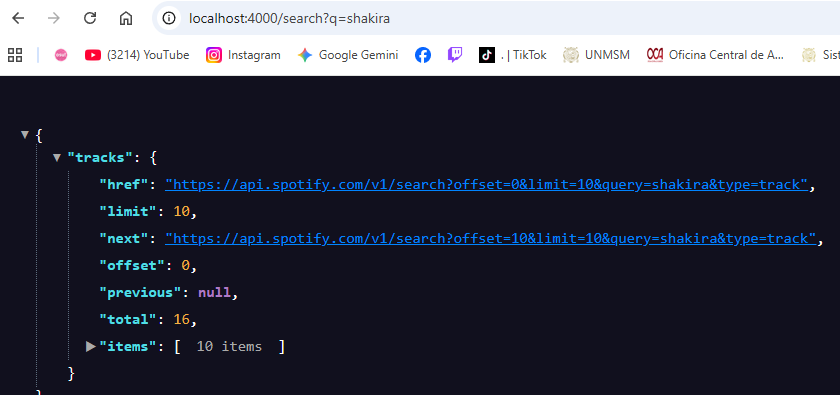

# Spotify Proxy API

Backend que actúa como proxy entre la Web API de Spotify y el Frontend,
evitando exponer las credenciales de Spotify en el cliente.

## Tecnologías

- Node.js
- Express
- Axios
- dotenv
- cors

## Requisitos

- Node.js v18 o superior
- Cuenta de desarrollador en Spotify

## Instalación

```bash
npm install
```

## Configuración

Crea un archivo `.env` en la raíz del proyecto:

```env
SPOTIFY_CLIENT_ID=tu_client_id
SPOTIFY_CLIENT_SECRET=tu_client_secret
PORT=4000
```

> Obtén tus credenciales en https://developer.spotify.com/dashboard

## Ejecutar

### Desarrollo

```bash
npm run dev
```

### Producción

```bash
npm start
```

El servidor corre en `http://localhost:4000`

## Endpoints

### GET /search

Busca canciones en Spotify por texto.

| Parámetro | Tipo   | Requerido | Descripción             |
| --------- | ------ | --------- | ----------------------- |
| q         | string | ✅        | Texto a buscar          |
| offset    | number | ❌        | Paginación (default: 0) |

**Ejemplo:**
GET http://localhost:4000/search?q=shakira&offset=0

**Respuesta exitosa:**

```json
{
  "tracks": {
    "items": [...],
    "total": 1000,
    "limit": 10,
    "offset": 0
  }
}
```

**Respuesta de error:**

```json
{
  "error": "El parámetro q es requerido"
}
```

## Screenshots

### Resultados del API de Spotify


